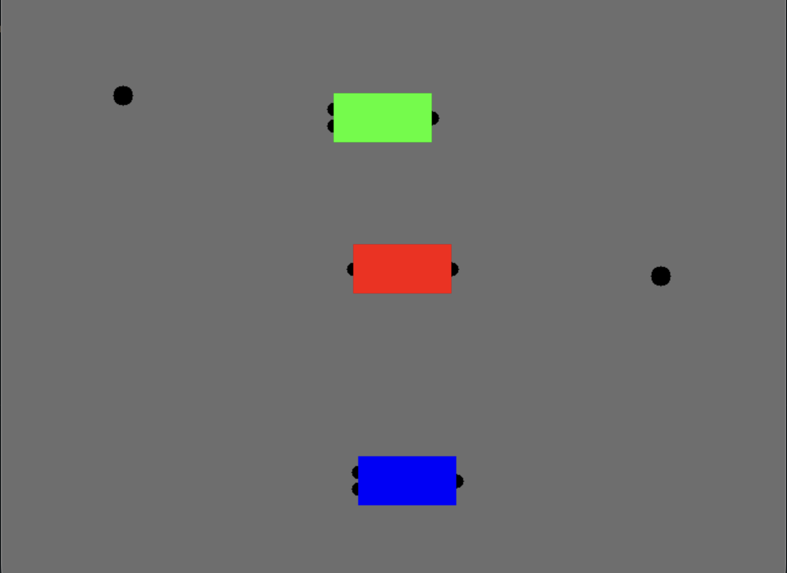
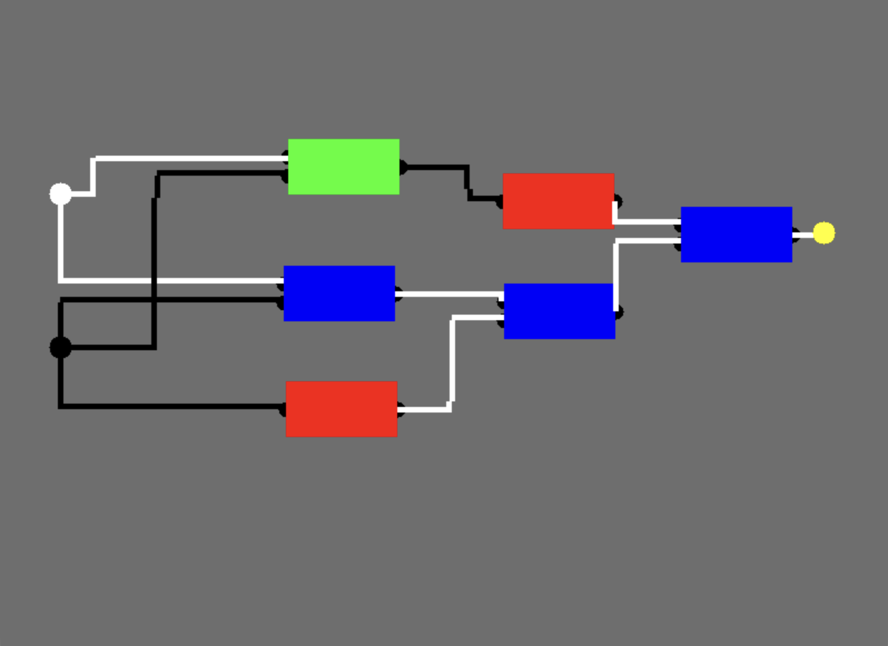

# Digital Logic Circuit Simulation 

## DESCRIPTION
This simulation is an interactive graphical simulation for building and testing simple
digital logic circuits. Users can place logic gates, toggle input sources, and
connect components together using wires to observe real-time signal propagation.

The simulation is designed as a learning and experimentation tool, emphasizing
clarity of behavior, visual feedback, and intuitive mouse-driven interaction.

---

## OVERVIEW

The simulation window consists of:

- Input sources (toggleable)
- Logic gates (AND, OR, NOT, etc.)
- Wires connecting outputs to inputs
- Real-time visual feedback for signal state

---

## INTERFACE

### Gates
- And gates are colored green
- Or gates are colored blue
- Nor gates are colored red

---

### Screenshot: Empty Simulation
<!-- SCREENSHOT: initial empty simulation window -->

---

### Screenshot: Gates and Inputs Placed
<!-- SCREENSHOT: gates and inputs placed -->

---

### Screenshot: Active Wires (On State)
<!-- SCREENSHOT: wires showing active/high signal -->

---

## CONTROLS

### Mouse Controls

| Action | Description |
|------|-------------|
| Left Click (Input) | Toggle input on/off |
| Left Click + Drag (Gate) | Move gate |
| Left Click + Drag (Pin) | Create wire |
| Release on Input Pin | Connect wire |
| Release elsewhere | Cancel wire |

---

### Keyboard Controls

| Key | Action |
|---|---|
| `R` | Reset simulation (if implemented) |
| `A` | Create an And gate |
| `O` | Create an Or gate |
| `N` | Create a Nor gate |
| `I` | Create an Input node |
| `L` | Create a Light |

---

## WIRING BEHAVIOR

- Wires connect **output pins** to **input pins**
- Each wire propagates a boolean signal
- Active (HIGH) wires are drawn in a different color than inactive (LOW) wires
- Wires are rendered orthogonally using an L-shaped path

---

### Screenshot: Wire Routing
<!-- SCREENSHOT: orthogonal wire routing -->

---

## LOGIC EVALUATION

Each simulation frame:

1. Input values are updated
2. Wire signals propagate to gate inputs
3. Gates evaluate their output
4. Visual state is updated

This ensures deterministic and predictable behavior.

---

## FILES

- `main.cpp` — application entry point
- `simulation.*` — simulation state and update logic
- `gate.*` — logic gate implementations
- `wire.*` — wire geometry and connections
- `input.*` — input source handling
- `light.*` - light handling
- `constants.h` - contains constants used throughout the program

---

## BUGS

Known limitations may include:

- No wire deletion (yet)
- No save/load functionality
- Limited gate types

Report issues by opening a GitHub issue.

---

## AUTHOR
Written by *Philip Gill*

---